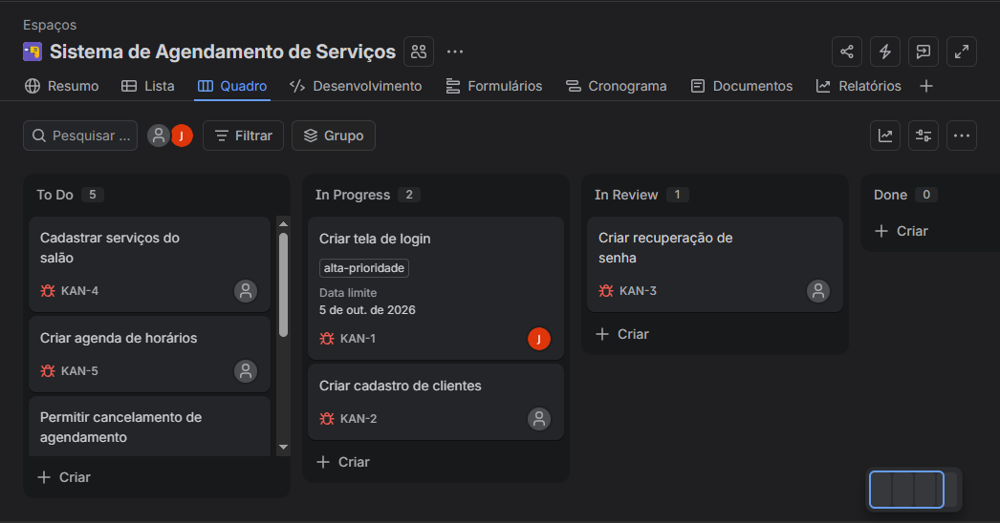
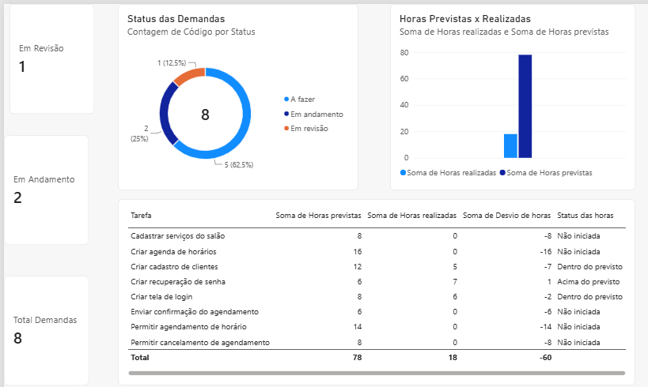

# Gestão Ágil de Projeto de TI

Projeto desenvolvido para aplicar, na prática, conceitos de metodologias ágeis, organização de demandas, acompanhamento de indicadores e análise de dados.

## 📌 Sobre o projeto

O projeto simula o acompanhamento do desenvolvimento de um sistema de agendamento de serviços.

As demandas foram organizadas e acompanhadas utilizando um quadro Kanban no Jira. Também foi desenvolvido um controle em Excel para acompanhamento das tarefas, horas previstas e realizadas e análise de desvios.

Os dados foram posteriormente utilizados no Power BI para criação de um dashboard de acompanhamento do projeto.

## 🛠️ Ferramentas utilizadas

- Jira
- Kanban
- Excel
- Power BI

## 📋 Gestão das demandas

As atividades do projeto foram cadastradas no Jira e organizadas de acordo com seu andamento:

- To Do
- In Progress
- In Review
- Done

## 📊 Controle e indicadores

No Excel foram desenvolvidos controles para acompanhamento de:

- Status das demandas
- Horas previstas
- Horas realizadas
- Desvio de horas
- Identificação de atividades acima do previsto

Também foi criado um dashboard no Power BI para facilitar a visualização dos principais indicadores do projeto.

## 📈 Indicadores acompanhados

- Total de demandas
- Demandas em andamento
- Demandas em revisão
- Distribuição das demandas por status
- Horas previstas x horas realizadas
- Desvio de horas por atividade

## 🎯 Aprendizados

Com este projeto, pude colocar em prática conhecimentos de gestão ágil, Kanban e acompanhamento de demandas, além de desenvolver habilidades em organização e análise de dados utilizando Excel e Power BI.
